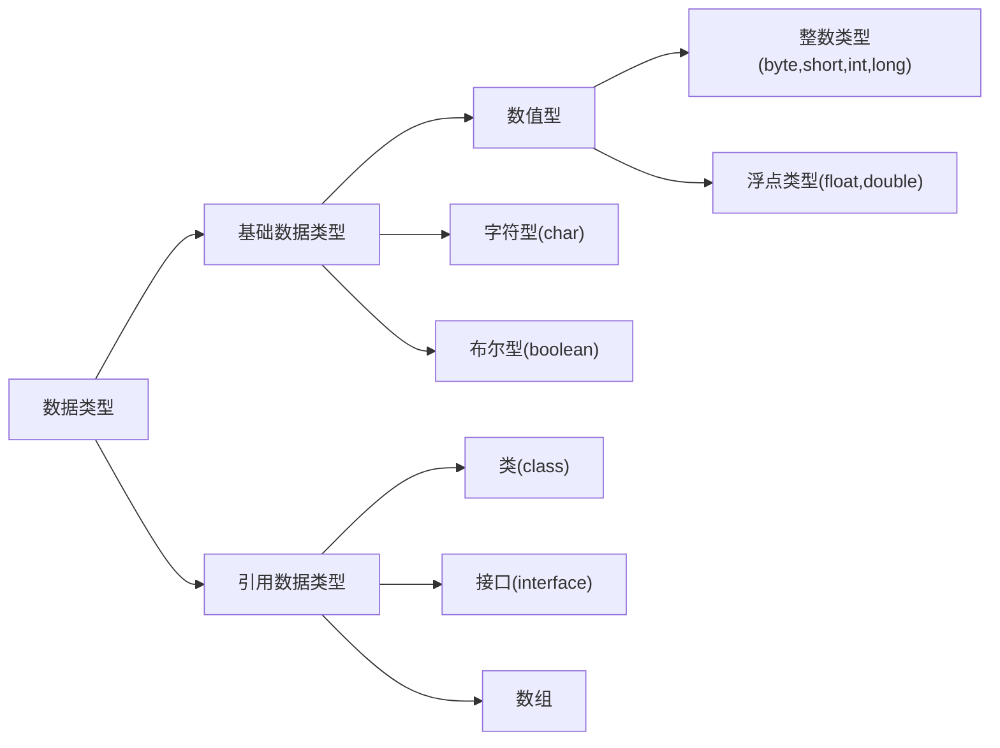
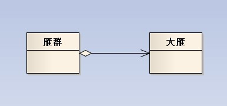
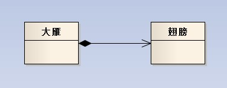
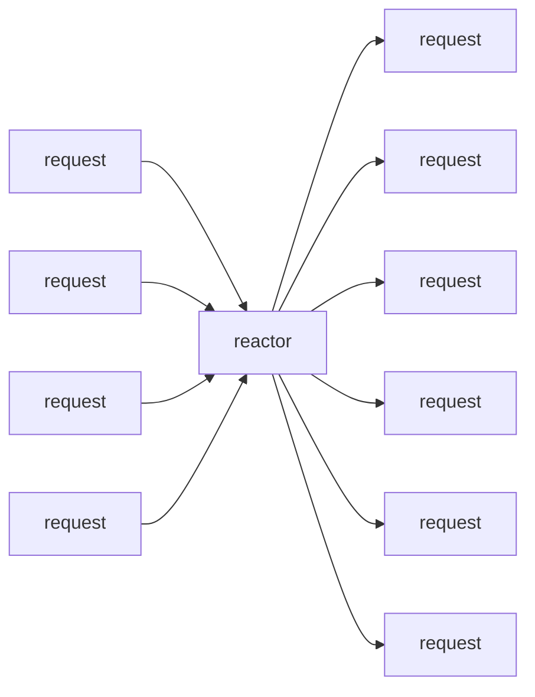
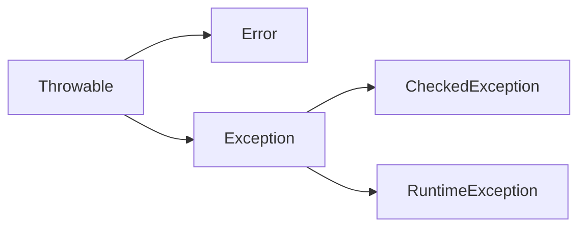

## 1. Java基础

### 1.1 单位换算

+ bit(位)：0,1
+ byte(字节)：1byte = 8bit
+ word(字)：1word = 2byte
+ 1KB = 1024bytes

### 1.2 Java中有几种基础类型，各占用多少字节



| 基础类型 |         大小          |                           取值范围                           |
| :------: | :-------------------: | :----------------------------------------------------------: |
| boolean  |       1字节/8位       |                         true, false                          |
|   byte   |  1字节/8位有符号整数  |                         -128 ~ +127                          |
|  short   | 2字节/16位有符号整数  |    -32768（-2<sup>15</sup>） ~ +32767(+2<sup>15</sup>-1)     |
|   int    | 4字节/32位有符号整数  | -2147483648（-2<sup>31</sup>） ~ +2147483647(2<sup>31</sup>-1) |
|   long   | 8字节/64位有符号整数  |               -2<sup>63</sup>~ +2<sup>63</sup>               |
|   char   | 2字节/16位Unicode字符 |                0 ~ 65535（2<sup>16</sup>-1 ）                |
|  float   |   4字节/32位浮点数    |                     ±1.4E-45 ~ ±3.4E+38                      |
|  double  |   8字节/64位浮点数    |                    ±4.9E-324 ~ ±1.7E+308                     |

### 1.3 JDK 和 JRE 有什么区别

+ JDK：Java Development Kit 的简称，java 开发工具包，提供了 java 的开发环境和运行环境。
+ JRE：Java Runtime Environment 的简称，java 运行环境，为 java 的运行提供了所需环境。

具体来说 JDK 其实包含了 JRE，同时还包含了编译 java 源码的编译器 javac，还包含了很多 java 程序调试和分析的工具。简单来说：如果你需要运行 java 程序，只需安装 JRE 就可以了，如果你需要编写 java 程序，需要安装 JDK。

### 1.4 作用域 public，private，protected，以及不写时的区别

1. public：可以被其他所有类访问
2. protected：可以被自身，子类，以及同一包下的类访问。
3. default：可以被自身和同一包中的类访问。
4. private：只可以被自身访问。

|  作用域   | 类内部 | 本包 | 子类 | 外部包 |
| :-------: | :----: | :--: | :--: | :----: |
|  public   |   √    |  √   |  √   |   √    |
| protected |   √    |  √   |  √   |   ×    |
|  default  |   √    |  √   |  ×   |   ×    |
|  private  |   √    |  ×   |  ×   |   ×    |

### 1.5 String 能被继承吗？为什么

不可以，因为 String 类有 final 修饰符，而 final 修饰的类是不能被继承的，实现细节不允许改变。平常我们定义的 `String str = ”a”` 其实和 `String str = new String(“a”)` 还是有差异的。

* 前者默认调用的是String.valueOf来返回String实例对象，至于调用哪个则取决于你的赋值，比如 String num = 1,调用的是

```java
public static String valueOf(int i) {
return Integer.toString(i);
}
```

* 后者则是调用如下部分：

```java
public String(String original) {
this.value = original.value;
this.hash = original.hash;
}
```

* 最后我们的变量都存储在一个char数组中

```java
private final char value[];
```

### 1.6 String， Stringbuffer， StringBuilder 的区别。

* String 字符串常量（final修饰，不可被继承），String是常量，当创建之后即不能更改。(可以通过StringBuffer和StringBuilder创建String对象（常用的两个字符串操作类）。)

* StringBuffer 字符串变量（线程安全），其也是final类别的，不允许被继承，其中的绝大多数方法都进行了同步处理，包括常用的Append方法也做了同步处理（synchronized修饰）。其自 jdk1.0 起就已经出现。其toString方法会进行对象缓存，以减少元素复制开销。

```java
public synchronized String toString() {
if (toStringCache == null) {
toStringCache = Arrays.copyOfRange(value, 0, count);
}
return new String(toStringCache, true);
}
```

* StringBuilder 字符串变量（非线程安全）==其自jdk1.5起开始出现。与StringBuffer一样都继承和实现了同样的接口和类，方法除了没使用synch修饰以外基本一致，不同之处在于最后toString的时候，会直接返回一个新对象。

```java
public String toString() {
// Create a copy, don’t share the array
return new String(value, 0, count);
}
```

---

1. 可变与不可变

* String 类中使用字符数组保存字符串，如下就是，因为有“final”修饰符，所以可以知道 string 对象是不可变的。`private final char value[];`

* StringBuilder 与 StringBuffer 都继承自AbstractStringBuilder类，在 AbstractStringBuilder 中也是使用字符数组保存字符串，如下就是，可知这两种对象都是可变的。`char[] value;`

2. 是否多线程安全

* String中的对象是不可变的，也就可以理解为常量，显然线程安全。

* AbstractStringBuilder 是 StringBuilder 与 StringBuffer 的公共父类，定义了一些字符串的基本操作，如 expandCapacity、append、insert、indexOf 等公共方法。

* StringBuffer对方法加了同步锁或者对调用的方法加了同步锁，所以是线程安全的。看如下源码：

```java
public synchronized StringBuffer reverse() {
super.reverse();
return this;
}

public int indexOf(String str) {
//存在 public synchronized int indexOf(String str, int fromIndex) 方法
return indexOf(str, 0);
}
```

* StringBuilder 并没有对方法进行加同步锁，所以是非线程安全的。

3. StringBuilder 与 StringBuffer 共同点

* StringBuilder 与StringBuffer 有公共父类 AbstractStringBuilder（抽象类）。
* 抽象类与接口的其中一个区别是：抽象类中可以定义一些子类的公共方法，子类只需要增加新的功能，不需要重复写已经存在的方法；而接口中只是对方法的申明和常量的定义。
* StringBuilder、StringBuffer 的方法都会调用 AbstractStringBuilder 中的公共方法，如super.append(...)。只是 StringBuffer 会在方法上加 synchronized 关键字，进行同步。

4. 最后，如果程序不是多线程的，那么使用 StringBuilder 效率高于 StringBuffer。

### 1.7 ArrayList 和 LinkedList 有什么区别。

​	ArrayList和LinkedList都实现了List接口，有以下的不同点：

1.  ArrayList是基于索引的数据接口，它的底层是数组。它可以以O(1)时间复杂度对元素进行随机访问。与此对应，LinkedList是以元素列表的形式存储它的数据，每一个元素都和它的前一个和后一个元素链接在一起，在这种情况下，查找某个元素的时间复杂度是O(n)。
2.  相对于ArrayList，LinkedList的插入，添加，删除操作速度更快，因为当元素被添加到集合任意位置的时候，不需要像数组那样重新计算大小或者是更新索引。
3.  LinkedList比ArrayList更占内存，因为LinkedList为每一个节点存储了两个引用，一个指向前一个元素，一个指向下一个元素。

### 1.8 ArrayList 和 Vector 的区别，HashMap 和 Hashtable 的区别 

就 ArrayList 与 Vector 主要从二方面来说：

1. 同步性：Vector是线程安全的，也就是说是同步的，而ArrayList是线程序不安全的，不是同步的
2. 数据增长：当需要增长时，Vector 默认增长为原来一倍，而ArrayList却是原来的一半

就 HashMap 与HashTable主要从三方面来说： 

1. 历史原因：Hashtable 是基于陈旧的 Dictionary 类的，HashMap 是Java 1.2引进的 Map 接口的一个实现
2. 同步性：Hashtable 是线程安全的，也就是说是同步的，而 HashMap 是线程序不安全的，不是同步的
3. 值：只有 HashMap 可以让你将空值作为一个表的条目的 key 或 value 

### 1.8 讲讲类的实例化顺序，比如父类静态数据，构造函数，字段，子类静态数据，构造函数，字段，当 new 的时候， 他们的执行顺序。

**此题考察的是类加载器实例化时进行的操作步骤（加载–连接-初始化）。**

父类静态变量、
父类静态代码块、
子类静态变量、
子类静态代码块、
父类非静态变量（父类实例成员变量）、
父类构造函数、
子类非静态变量（子类实例成员变量）、
子类构造函数。

[参阅博客《深入理解类加载》](http://blog.csdn.net/u014042066/article/details/77394480)

### 1.7 用过哪些 Map 类，都有什么区别？

1. HashMap：

最常用的Map，根据键的hashcode值来存储数据，根据键可以直接获得他的值（因为相同的键hashcode值相同，在地址为hashcode值的地方存储的就是值，所以根据键可以直接获得值），具有很快的访问速度，遍历时，取得数据的顺序完全是随机的，HashMap最多只允许一条记录的键为null，允许多条记录的值为null，HashMap不支持线程同步，即任意时刻可以有多个线程同时写HashMap，这样对导致数据不一致，如果需要同步，可以使用synchronziedMap的方法使得HashMap具有同步的能力或者使用concurrentHashMap。

2. HashTable：

与HashMap类似，不同的是，它不允许记录的键或值为空，支持线程同步，即任意时刻只能有一个线程写HashTable，因此也导致HashTable在写入时比较慢!

3. LinkedHashMap：

是HahsMap的一个子类，但它保持了记录的插入顺序，遍历时先得到的肯定是先插入的，也可以在构造时带参数，按照应用次数排序，在遍历时会比HahsMap慢，不过有个例外，当HashMap的容量很大，实际数据少时，遍历起来会比LinkedHashMap慢（因为它是链啊），因为HashMap的遍历速度和它容量有关，LinkedHashMap遍历速度只与数据多少有关。

4. TreeMap：

实现了sortMap接口，能够把保存的记录按照键排序（默认升序），也可以指定排序比较器，遍历时得到的数据是排过序的。

### 1.8 什么情况用什么类型的Map：

* 在Map中插入，删除，定位元素：HashMap
* 要按照自定义顺序或自然顺序遍历：TreeMap
* 要求输入顺序和输出顺序相同：LinkedHashMap

### 1.9 HashMap 是线程安全的吗，并发下使用的 Map 是什么，他们内部原理分别是什么，比如存储方式， hashcode，扩容， 默认容量等。

* hashMap是线程不安全的，HashMap是数组 + 链表 + 红黑树（JDK1.8增加了红黑树部分）实现的，采用哈希表来存储的。
* HashTable、ConcurrentHashMap 

### 1.10 有没有有顺序的 Map 实现类， 如果有， 他们是怎么保证有序的。

TreeMap 和 LinkedHashMap 是有序的（TreeMap 默认是key升序，LinkedHashMap 默认是数据插入顺序）。

* TreeMap 是基于比较器Comparator来实现有序的。
* LinkedHashmap 是基于链表来实现数据插入有序的。

### 1.11 抽象类和接口的区别，类可以继承多个类么，接口可以继承多个接口么,类可以实现多个接口么。

1. 抽象类和接口都不能直接实例化，如果要实例化，抽象类变量必须指向实现所有抽象方法的子类对象，接口变量必须指向实现所有接口方法的类对象。
2. 抽象类要被子类继承，接口要被类实现。
3. 接口只能做方法申明，抽象类中可以做方法申明，也可以做方法实现。
4. 接口里定义的变量只能是公共的静态的常量，抽象类中的变量是普通变量。
5. 抽象类里的抽象方法必须全部被子类所实现，如果子类不能全部实现父类抽象方法，那么该子类只能是抽象类。同样，一个实现接口的时候，如不能全部实现接口方法，那么该类也只能为抽象类。
6. 抽象方法只能申明，不能实现。abstract void abc(); 不能写成 abstract void abc() {}。
7. 抽象类里可以没有抽象方法。
8. 如果一个类里有抽象方法，那么这个类只能是抽象类。
9. 抽象方法要被实现，所以不能是静态的，也不能是私有的。
10. 接口可继承接口，并可多继承接口，但类只能单根继承。

### 1.12 继承、实现、依赖、关联、聚合、组合的联系与区别

1. **继承**：指的是一个类（称为子类、子接口）继承另外的一个类（称为父类、父接口）的功能，并可以增加它自己的新功能的能力，继承是类与类或者接口与接口之间最常见的关系；在 Java 中此类关系通过关键字extends明确标识，在设计时一般没有争议性。


2. **实现**：指的是一个 class 类实现 interface 接口（可以是多个）的功能；实现是类与接口之间最常见的关系；在 Java 中此类关系通过关键字 implements 明确标识，在设计时一般没有争议性；


3. **依赖**：可以简单的理解，就是一个类A使用到了另一个类B，而这种使用关系是具有偶然性的、临时性的、非常弱的，但是B类的变化会影响到A；比如某人要过河，需要借用一条船，此时人与船之间的关系就是依赖；表现在代码层面，为类B作为参数被类A在某个 method 方法中使用。


4. **关联**：他体现的是两个类、或者类与接口之间语义级别的一种强依赖关系，比如我和我的朋友；这种关系比依赖更强、不存在依赖关系的偶然性、关系也不是临时性的，一般是长期性的，而且双方的关系一般是平等的、关联可以是单向、双向的；表现在代码层面，为被关联类B以类属性的形式出现在关联类A中，也可能是关联类A引用了一个类型为被关联类B的全局变量。


5. **聚合**：是关联关系的一种特例，他体现的是整体与部分、拥有的关系，即 has-a 的关系，此时整体与部分之间是可分离的，他们可以具有各自的生命周期，部分可以属于多个整体对象，也可以为多个整体对象共享；比如计算机与CPU、公司与员工的关系等；表现在代码层面，和关联关系是一致的，只能从语义级别来区分。


6. **组合 (a拥有b，a没了b也就没了，实心)**：组合也是关联关系的一种特例，他体现的是一种contains-a的关系，这种关系比聚合更强，也称为强聚合；他同样体现整体与部分间的关系，但此时整体与部分是不可分的，整体的生命周期结束也就意味着部分的生命周期结束；比如你和你的大脑；表现在代码层面，和关联关系是一致的，只能从语义级别来区分。


* 聚合关系图：



* 组合关系图：



### 1.13 讲讲你理解的 BIO 和 NIO 的区别是啥，谈谈 reactor 模型。

IO(BIO)是面向流的，NIO是面向缓冲区的

* BIO：Block IO 同步阻塞式 IO，就是我们平常使用的传统 IO，它的特点是模式简单使用方便，并发处理能力低。
* NIO：New IO 同步非阻塞 IO，是传统 IO 的升级，客户端和服务器端通过 Channel（通道）通讯，实现了多路复用。
* AIO：Asynchronous IO 是 NIO 的升级，也叫 NIO2，实现了异步非堵塞 IO ，异步 IO 的操作基于事件和回调机制。

---

|   IO   |   NIO    |
| :----: | :------: |
| 面向流 | 面向缓冲 |
| 阻塞IO | 非阻塞IO |
|   无   |  选择器  |

[Java NIO与BIO](https://www.jianshu.com/p/3f703d3d804c)

---

|                    | 同步阻塞IO |  伪异步IO  |     NIO      |     AIO      |
| :----------------: | :--------: | :--------: | :----------: | :----------: |
| 客户端数目：IO线程 |    1:1     |    m:n     |     m:1      |     m:0      |
|       IO模型       | 同步阻塞IO | 同步阻塞IO | 同步非阻塞IO | 异步非阻塞IO |
|       吞吐量       |     低     |     中     |      高      |      高      |
|     编程复杂度     |    简单    |    简单    |   非常复杂   |     复杂     |


**Reactor是什么？**

1. 事件驱动
2. 可以处理一个或多个输入源
3. 通过Service Handle同步的将输入事件采用多路复用分发给相应的Request Handler(一个或多个）处理




### 1.14 反射的原理，反射创建类实例的三种方式是什么？

1. **什么是JAVA的反射机制？**

* Java反射是Java被视为动态（或准动态）语言的一个关键性质。这个机制允许程序在运行时透过Reflection APIs 取得任何一个已知名称的class的内部信息，包括其modifiers（诸如public, static 等）、superclass（例如Object）、实现之interfaces（例如Cloneable），也包括fields和methods的所有信息，并可于运行时改变fields内容或唤起methods。

Java反射机制容许程序在运行时加载、探知、使用编译期间完全未知的classes。

换言之，Java可以加载一个运行时才得知名称的class，获得其完整结构。

* 反射机制能够实现**在运行时对类进行装载**，因此能增加程序的灵活性，但是不恰当地使用反射机制，也会严重影响系统的性能。具体而言，反射机制提供的功能主要有：得到一个对象所属的类；获取一个类的所有成员变量和方法；在运行时创建对象；在运行时调用对象的方法。
可以配合[JVM加载class文件的原理机制](https://www.jianshu.com/p/cdfdeffc8d34)来理解

2. **JDK中提供的Reflection API**

| Member接口         | 该接口可以获取有关类成员（域或者方法）后者构造函数的信息。   |
| ------------------ | ------------------------------------------------------------ |
| AccessibleObject类 | 该类是域(field)对象、方法(method)对象、构造函数(constructor)对象的基础类。它提供了将反射的对象标记为在使用时取消默认 Java 语言访问控制检查的能力。 |
| Array类            | 该类提供动态地生成和访问JAVA数组的方法。                     |
| Constructor类      | 提供一个类的构造函数的信息以及访问类的构造函数的接口。       |
| Field类            | 提供一个类的域的信息以及访问类的域的接口。                   |
| Method类           | 提供一个类的方法的信息以及访问类的方法的接口。               |
| Modifier类         | 提供了 static 方法和常量，对类和成员访问修饰符进行解码。     |
| Proxy类            | 提供动态地生成代理类和类实例的静态方法。                     |

3. **JAVA反射机制提供了什么功能**

* 在运行时判断任意一个对象所属的类（获取类的Class对象）
* 在运行时构造任意一个类的对象（获取类的Fields）
* 在运行时判段任意一个类所具有的成员变量和方法（获取类的Method）
* 在运行时调用任一个对象的方法（获取类的Constructor）
* 在运行时创建新类对象（新建类的实例）

4. **反射创建类实例的三种方式**

1. 使用 Class.forName 静态方法。

前提：已明确类的全路径名。

2. 使用 .class 方法。

说明：仅适合在编译前就已经明确要操作的 Class

3. 使用类对象的 getClass() 方法。

```java
// 创建Class对象的方式一：(对象.getClass())，获取类中的字节码文件
Class class1 = p1.getClass();

// 创建Class对象的方式二：(类.class:需要输入一个明确的类，任意一个类型都有一个静态的class属性)
Class class3 = Person.class;

// 创建Class对象的方式三：(forName():传入时只需要以字符串的方式传入即可)
// 通过Class类的一个forName（String className)静态方法返回一个Class对象，className必须是全路径名称；
// Class.forName()有异常：ClassNotFoundException
Class   class4 = Class.forName("Person");
```


### 1.15 反射中，Class.forName 和 ClassLoader 区别。

在Java中，类装载器把一个类装入Java虚拟机中，要经过三个步骤来完成：装载、链接和初始化，其中链接又可以分成校验、准备和解析三步，除了解析外，其它步骤是严格按照顺序完成的，各个步骤的主要工作如下：

1. 装载：查找和导入类或接口的二进制数据； 
2. 链接：执行下面的校验、准备和解析步骤，其中解析步骤是可以选择的； 
3. 校验：检查导入类或接口的二进制数据的正确性； 
4. 准备：给类的静态变量分配并初始化存储空间； 
5. 解析：将符号引用转成直接引用； 
6. 初始化：激活类的静态变量的初始化Java代码和静态Java代码块。

*  Class.forName(className)方法，其实调用的方法是Class.forName(className,true,classloader);注意看第2个boolean参数，它表示的意思，在loadClass后必须初始化。比较下我们前面准备jvm加载类的知识，我们可以清晰的看到在执行过此方法后，目标对象的 static块代码已经被执行，static参数也已经被初始化。
* 再看ClassLoader.loadClass(className)方法，其实他调用的方法是ClassLoader.loadClass(className,false);还是注意看第2个 boolean参数，该参数表示目标对象被装载后不进行链接，这就意味这不会去执行该类静态块中间的内容。因此2者的区别就显而易见了。

最后还有必要在此提一下new方法和newInstance方法的区别：

* newInstance：弱类型。低效率。只能调用无参构造。
* new：强类型。相对高效。能调用任何public构造。

### 1.16 描述动态代理的几种实现方式，分别说出相应的优缺点。

两种方式，分别是：JDK动态代理、cglib动态代理

* JDK动态代理

- 利用反射机制生成一个实现代理接口的匿名类，在调用具体方法前调用InvokeHandler来处理。

- JDK动态代理，底层是利用反射机制，需要基于接口方式，这是由于：

```java
Proxy.newProxyInstance(target.getClass().getClassLoader(),
target.getClass().getInterfaces(), this);
```

* cglib动态代理

- cglib动态代理，则是基于asm框架，实现了无反射机制进行代理，利用空间来换取了时间，代理效率高于jdk
- 利用asm开源包，对代理对象类的class文件加载进来，通过修改其字节码生成子类来处理。

**区别**

* JDK动态代理只能对实现了接口的类生成代理，而不能针对类

* CGLIB是针对类实现代理，主要是对指定的类生成一个子类，覆盖其中的方法 因为是继承，所以该类或方法不要声明成final

**问题：为什么 CGlib 方式可以对接口实现代理。**

​	（可以直接回答上述区别中CGLIB的特点）

### 1.17 final 的用途

**针对三方面类、变量、方法**

* final 修饰的类叫最终类，该类不能被继承。
* final 修饰的变量叫常量，常量必须初始化，初始化之后值就不能被修改。
* final 修饰的方法不能被重写。

### 1.18 写出三种单例模式实现

**什么是单例模式**

​		单例模式（Singleton Pattern）是 Java 中最简单的设计模式之一。这种类型的设计模式属于创建型模式，它提供了一种创建对象的最佳方式。

​		这种模式涉及到一个单一的类，该类负责创建自己的对象，同时确保只有单个对象被创建。这个类提供了一种访问其唯一的对象的方式，可以直接访问，不需要实例化该类的对象。

注意：

1. 单例类只能有一个实例。
2. 单例类必须自己创建自己的唯一实例。
3. 单例类必须给所有其他对象提供这一实例。


懒汉式、饿汉式、双检锁、静态内部类、枚举等

1. **懒汉式（线程不安全）**

线程不安全，延迟初始化，严格意义上不是不是单例模式

```java
public class Singleton {

private static Singleton instance;

private Singleton () {}

public static Singleton getInstance() {
if (instance == null) {
instance = new Singleton();
}
return instance;
}

}
```

2. **懒汉式（线程安全）**

线程安全，延迟初始化，严格意义上不是不是单例模式

```java
public class Singleton {

private static Singleton instance;

private Singleton () {}

public static synchronized Singleton getInstance() {
if (instance == null) {
instance = new Singleton();
}
return instance;
}

}
```

3. **饿汉式**

线程安全，比较常用，但容易产生垃圾，因为一开始就初始化

```java
public class Singleton {

private static Singleton instance = new Singleton();

private Singleton () {}

public static Singleton getInstance() {
return instance;
}

}
```

4. **双检锁**

线程安全，延迟初始化。这种方式采用双锁机制，安全且在多线程情况下能保持高性能。

```java
public class Singleton {

private volatile static Singleton singleton;

private Singleton (){}

public static Singleton getSingleton() {
if (singleton == null) {
synchronized (Singleton.class) {
if (singleton == null) {
singleton = new Singleton();
}
}
}
return singleton;
}

}
```

5. 静态内部类

只有第一次调用getInstance方法时，虚拟机才加载 Inner 并初始化instance ，只有一个线程可以获得对象的初始化锁，其他线程无法进行初始化，保证对象的唯一性。目前此方式是所有单例模式中最推荐的模式，但具体还是根据项目选择。

```java
public class Singleton {

private static class SingletonHolder {
private static final Singleton INSTANCE = new Singleton();
}

private Singleton () {}

public static final Singleton getInstance() {
return SingletonHolder.INSTANCE;
}

} 
```

6. 枚举

这种方式是Effective Java作者Josh Bloch 提倡的方式，它不仅能避免多线程同步问题，而且还能防止反序列化重新创建新的对象，可谓是很坚强的壁垒啊，不过，个人认为由于1.5中才加入enum特性，用这种方式写不免让人感觉生疏，在实际工作中，我也很少看见有人这么写过。

```java
public enum Singleton {

INSTANCE;

public void whateverMethod() {
}

}
```

### 1.19 如何在父类中为子类自动完成所有的 hashcode 和 equals 实现？这么做有何优劣？

同时复写hashcode和equals方法，优势可以添加自定义逻辑，且不必调用超类的实现。

相似问题：说一说你对 java.lang.Object 对象中 hashCode 和 equals 方法的理解。在什么场景下需要重新实现这两个方法

[equals和hashCode解析](https://www.iteye.com/blog/java-min-1416727)

### 1.20 请结合 OO 设计理念，谈谈访问修饰符 public、private、protected、default 在应用设计中的作用。

访问修饰符，主要标示修饰块的作用域，方便隔离防护

类中的数据成员和成员函数据具有的访问权限包括：public、private、protect、default（包访问权限）

|  作用于   | 当前类 | 同一package | 子孙类 | 其他package |
| :-------: | :----: | :---------: | :----: | :---------: |
|  public   |   √    |      √      |   √    |      √      |
| protected |   √    |      √      |   √    |      ×      |
|  default  |   √    |      √      |   ×    |      ×      |
|  private  |   √    |      ×      |   ×    |      ×      |

### 1.21 深拷贝和浅拷贝区别。

**什么是拷贝?**

* **引用拷贝**，正如它的名称所表述的意思, 就是创建一个指向对象的引用变量的拷贝。如果我们有一个 Car 对象，而且让 myCar 变量指向这个变量，这时候当我们做引用拷贝，那么现在就会有两个 myCar 变量，但是对象仍然只存在一个。
* **对象拷贝**，会创建对象本身的一个副本。因此如果我们再一次服务我们 car 对象，就会创建这个对象本身的一个副本, 同时还会有第二个引用变量指向这个被复制出来的对象。

* **浅拷贝**，对象的浅拷贝会对“主”对象进行拷贝，但不会复制主对象里面的对象。"里面的对象“会在原来的对象和它的副本之间共享。例如，我们会为一个 Person对象创建第二个 Person 对象, 而两个 Person 会共享相同的 Name 和 Address 对象。
* **深拷贝**，不同于浅拷贝，深拷贝是一个整个独立的对象拷贝。如果我们对整个 Person对象进行深拷贝，我们会对整个对象的结构都进行拷贝。

简单来说浅拷贝跟深拷贝的区别就是复制引用和复制值

### 1.22 数组和链表数据结构描述，各自的时间复杂度。

* **数组**：是将元素在内存中连续存放，由于每个元素占用内存相同，可以通过下标迅速访问数组中任何元素。但是如果要在数组中增加一个元素，需要移动大量元素，在内存中空出一个元素的空间，然后将要增加的元素放在其中。同样的道理，如果想删除一个元素，同样需要移动大量元素去填掉被移动的元素。如果应用需要快速访问数据，很少插入和删除元素，就应该用数组。
* **链表**：中的元素在内存中不是顺序存储的，而是通过存在元素中的指针联系到一起，每个结点包括两个部分：一个是存储 数据元素 的　数据域，另一个是存储下一个结点地址的 指针。如果要访问链表中一个元素，需要从第一个元素开始，一直找到需要的元素位置。但是增加和删除一个元素对于链表数据结构就非常简单了，只要修改元素中的指针就可以了。如果应用需要经常插入和删除元素你就需要用链表。

**内存存储区别**

* 数组从栈中分配空间，对于程序员方便快速，但自由度小。
* 链表从堆中分配空间，自由度大但申请管理比较麻烦。

**逻辑结构区别**

* **数组**必须事先定义固定的长度（元素个数），不能适应数据动态地增减的情况。当数据增加时，可能超出原先定义的元素个数；当数据减少时，造成内存浪费。　
* **链表**动态地进行存储分配，可以适应数据动态地增减的情况，且可以方便地插入、删除数据项。（数组中插入、删除数据项时，需要移动其它数据项）

**总结**

1. 存取方式上，数组可以顺序存取或者随机存取，而链表只能顺序存取；

2. 存储位置上，数组逻辑上相邻的元素在物理存储位置上也相邻，而链表不一定；

3. 存储空间上，链表由于带有指针域，存储密度不如数组大；

4. 按序号查找时，数组可以随机访问，时间复杂度为O(1)，而链表不支持随机访问，平均需要O(n)；

5. 按值查找时，若数组无序，数组和链表时间复杂度均为O(1)，但是当数组有序时，可以采用折半查找将时间复杂度降为O(logn)；

6. 插入和删除时，数组平均需要移动n/2个元素，而链表只需修改指针即可；

7. 空间分配方面： 

* 数组在静态存储分配情形下，存储元素数量受限制，动态存储分配情形下，虽然存储空间可以扩充，但需要移动大量元素，导致操作效率降低，而且如果内存中没有更大块连续存储空间将导致分配失败； 

* 链表存储的节点空间只在需要的时候申请分配，只要内存中有空间就可以分配，操作比较灵活高效；

### 1.23 error 和 exception 的区别，CheckedException，RuntimeException 的区别



* java.lang.Throwable是所有异常的根
* java.lang.Error是错误信息
* java.lang.Exception是异常信息

**Exception**

一般分为Checked异常和Runtime异常，所有RuntimeException类及其子类的实例被称为Runtime异常，不属于该范畴的异常则被称为CheckedException。

**CheckedException**：只有java语言提供了Checked异常，Java认为Checked异常都是可以被处理的异常，所以Java程序必须显示处理Checked异常。如果程序没有处理Checked异常，该程序在编译时就会发生错误无法编译。这体现了Java的设计哲学：没有完善错误处理的代码根本没有机会被执行。对Checked异常处理方法有两种：

1. 当前方法知道如何处理该异常，则用try...catch块来处理该异常。
2. 当前方法不知道如何处理，则在定义该方法是声明抛出该异常。

我们比较熟悉的Checked异常有：

* Java.lang.ClassNotFoundException
* Java.lang.NoSuchMetodException
* java.io.IOException

**RuntimeException**： Runtime如除数是0和数组下标越界等，其产生频繁，处理麻烦，若显示申明或者捕获将会对程序的可读性和运行效率影响很大。所以由系统自动检测并将它们交给缺省的异常处理程序。当然如果你有处理要求也可以显示捕获它们。

我们比较熟悉的RumtimeException子类：

* Java.lang.ArithmeticException
* Java.lang.ArrayStoreExcetpion
* Java.lang.ClassCastException
* Java.lang.IndexOutOfBoundsException
* Java.lang.NullPointerException

**Error**

当程序发生不可控的错误时，通常做法是通知用户并中止程序的执行。与异常不同的是Error及其子类的对象不应被抛出。

Error是throwable的子类，代表编译时间和系统错误，用于指示合理的应用程序不应该试图捕获的严重问题。

Error由Java虚拟机生成并抛出，包括动态链接失败，虚拟机错误等。程序对其不做处理。

[Java异常分类](https://blog.csdn.net/woshixuye/article/details/8230407)

### 1.24 在自己的代码中，如果创建一个 java.lang.String 对象，这个对象是否可以被类加载器加载？为什么

类加载无须等到“首次使用该类”时加载，jvm允许预加载某些类。

[java加载机制整理](https://www.cnblogs.com/jasonstorm/p/5663864.html)

---

类加载使用的是双亲委派模型，当你想要加载一个类的时候，必须先给你的父加载器，它再去想办法加载，如果它不能加载，再告诉我们，我们自己想办法。所以，在java中java.lang.String肯定在上层的ClassLoader被加载过了，所以你自己写的完全没有机会加载。如果可以加载的话，那么我们可以把所有java自带的类全部重写用我们自己的，这样大家使用就没有一些约定好的类，不知道要怎么办才好。

### 1.25 在 jdk1.5 中，引入了泛型，泛型的存在是用来解决什么问题。

泛型的本质是参数化类型，也就是说所操作的数据类型被指定为一个参数，泛型的好处是在编译的时候检查类型安全，并且所有的强制转换都是自动和隐式的，以提高代码的重用率。

---

泛型的本质是参数化类型，这种参数类型可以用在类、接口和方法的创建中，分别称为泛型类、泛型接口、泛型方法。
在 Java SE 1.5 之前没有泛型的情况的下只能通过对类型 Object 的引用来实现参数的任意化，其带来的缺点是要做显式强制类型转换，而这种强制转换编译期是不做检查的，容易把问题留到运行时，所以 泛型的好处是在编译时检查类型安全，并且所有的强制转换都是自动和隐式的，提高了代码的重用率，避免在运行时出现 ClassCastException。

### 1.26 这样的 a.hashcode() 有什么用，与 a.equals(b)有什么关系。

**hashcode**
hashcode（）方法提供了对象的hashCode值，是一个native方法，返回的默认值与System.identityHashCode(obj)一致。通常这个值是对象头部的一部分二进制位组成的数字，具有一定的标识对象的意义存在，但绝不定于地址。作用是：用一个数字来标识对象。比如在HashMap、HashSet等类似的集合类中，如果用某个对象本身作为Key，即要基于这个对象实现Hash的写入和查找，那么对象本身如何实现这个呢？就是基于hashcode这样一个数字来完成的，只有数字才能完成计算和对比操作。

**hashcode是否唯一**
hashcode只能说是标识对象，在hash算法中可以将对象相对离散开，这样就可以在查找数据的时候根据这个key快速缩小数据的范围，但hashcode不一定是唯一的，所以hash算法中定位到具体的链表后，需要循环链表，然后通过equals方法来对比Key是否是一样的。

**equals与hashcode的关系**
equals相等两个对象，则hashcode一定要相等。但是hashcode相等的两个对象不一定equals相等。

### 1.27 有没有可能 2 个不相等的对象有相同的 hashcode。

有，实例:

```java
String str1 = "通话";
String str2 = "重地";
System.out.println(String.format("str1：%d | str2：%d", str1.hashCode(),str2.hashCode()));
System.out.println(str1.equals(str2));

// 执行结果:
// str1：1179395 | str2：1179395
// false
```

### 1.28 Java 中的 HashSet 内部是如何工作的。

**底层是基于hashmap实现的**

HashSet 实际上是一个HashMap实例，都是一个存放链表的数组。它不保证存储元素的迭代顺序；此类允许使用null元素。HashSet 中不允许有重复元素，这是因为 HashSet 是基于HashMap实现的，HashSet 中的元素都存放在 HashMap 的 key 上面，而value中的值都是统一的一个固定对象 private static final Object PRESENT = new Object();

HashSet 中 add 方法调用的是底层 HashMap 中的put()方法，而如果是在 HashMap 中调用put，首先会判断key是否存在，如果key存在则修改 value 值，如果key不存在这插入这个 key-value。而在set中，因为value 值没有用，也就不存在修改 value 值的说法，因此往 HashSet 中添加元素，首先判断元素（也就是key）是否存在，如果不存在这插入，如果存在着不插入，这样 HashSet 中就不存在重复值。

所以判断key是否存在就要重写元素的类的 equals() 和 hashCode() 方法，当向Set中添加对象时，首先调用此对象所在类的 hashCode() 方法，计算次对象的哈希值，此哈希值决定了此对象在 Set 中存放的位置；若此位置没有被存储对象则直接存储，若已有对象则通过对象所在类的 equals() 比较两个对象是否相同，相同则不能被添加。

### 1.29 什么是序列化，怎么序列化，为什么序列化，反序列化会遇到什么问题，如何解决。

**序列化 (Serialization)**：是将对象的状态信息转换为可以存储或传输的形式的过程。在序列化期间，对象将其当前状态写入到临时或持久性存储区。以后，可以通过从存储区中读取或反序列化对象的状态，重新创建该对象。

序列化使其他代码可以查看或修改，那些不序列化便无法访问的对象实例数据。确切地说，代码执行序列化需要特殊的权限：即指定了 SerializationFormatter 标志的 SecurityPermission。在默认策略下，通过 Internet 下载的代码或 Internet 代码不会授予该权限；只有本地计算机上的代码才被授予该权限。

通常，对象实例的所有字段都会被序列化，这意味着数据会被表示为实例的序列化数据。这样，能够解释该格式的代码有可能能够确定这些数据的值，而不依赖于该成员的可访问性。类似地，反序列化从序列化的表示形式中提取数据，并直接设置对象状态，这也与可访问性规则无关。

对于任何可能包含重要的安全性数据的对象，如果可能，应该使该对象不可序列化。如果它必须为可序列化的，请尝试生成特定字段来保存不可序列化的重要数据。如果无法实现这一点，则应注意该数据会被公开给任何拥有序列化权限的代码，并确保不让任何恶意代码获得该权限。

**什么情况下会用到序列化？**

1. 当你想把内存中的对象写入到硬盘时
2. 当你想用套接字在网络上传输对象时
3. 当你想通过RMI调用对象时
（**RMI是什么东西？**）：RMI总结来说就是远程调用对象，在一个jvm上调用另一个jvm的对象。

**序列化需要注意的事项**

1. 序列化只保存对象的状态，而不管对象的方法。
2. 当一个父类实现了序列化，它的子类也自动实现序列化，不用显示进行实现了。
3. 当一个实例对象引用其他对象，当序列化该对象时也把引用的对象进行了实例化。

### 1.30 == 和 equals 的区别是什么？

**== 解读**

对于基本类型和引用类型 == 的作用效果是不同的，如下所示：

+ 基本类型：比较的是值是否相同；
+ 引用类型：比较的是引用是否相同；

代码示例：

```java
String x = "string";
String y = "string";
String z = new String("string");
System.out.println(x == y); // true
System.out.println(x == z); // false
System.out.println(x.equals(y)); // true
System.out.println(x.equals(z)); // true
```

代码解读：因为 x 和 y 指向的是同一个引用，所以 == 也是 true，而 new String()方法则重写开辟了内存空间，所以 == 结果为 false，而 equals 比较的一直是值，所以结果都为 true。

**equals 解读**
equals 本质上就是 ==，只不过 String 和 Integer 等重写了 equals 方法，把它变成了值比较。看下面的代码就明白了。
首先来看默认情况下 equals 比较一个(有相同值的对象)，代码如下：

```java
public class Cat {
private  String name;

public Cat(String name){
this.name = name;
}

public String getName() {
return name;
}

public void setName(String name) {
this.name = name;
}

public static void main(String[] args) {
Cat c1 = new Cat("cat1");//c1是Cat的实例化对象,c2同理
Cat c2 = new Cat("cat2");
String s1 = new String("隔壁老王");
String s2 = new String("隔壁老王");
System.out.println(c1.equals(c2));	//false,equals在比较的类对象的时候比较的是引用
System.out.println(s1.equals(s2));	//true,而在比较string的时候,因为重写了equals方法,和基本数据类型一样,比较的是值,所以为true
}
```

**总结**

== 对于基本类型来说是值比较(不难理解,八种基本数据类型是可以有确定值的)，对于引用类型来说是比较的是引用(数组、类、接口没有确定值)；而 equals 默认情况下是引用比较，只是很多类重新了 equals 方法，比如 String、Integer 等把它变成了值比较，所以一般情况下 equals 比较的是值是否相等。

### 1.31 java 中的 Math.round(-1.5) 等于多少？

等于 -1，

因为在数轴上取值时，中间值（0.5）向右取整，所以正 0.5 是往上取整，负 0.5 是直接舍弃。同理, Math.round(1.5) = 2

### 1.32 写一个字符串反转函数。

```java
// StringBuffer reverse
StringBuffer stringBuffer = new StringBuffer();
stringBuffer.append("abcdefg");
System.out.println(stringBuffer.reverse()); // gfedcba
// StringBuilder reverse
StringBuilder stringBuilder = new StringBuilder();
stringBuilder.append("abcdefg");
System.out.println(stringBuilder.reverse()); // gfedcba
```

### 1.33 String 类的常用方法都有那些？

* indexOf()：返回指定字符的索引。
* charAt()：返回指定索引处的字符。
* replace()：字符串替换。
* trim()：去除字符串两端空白。
* split()：分割字符串，返回一个分割后的字符串数组。
* getBytes()：返回字符串的 byte 类型数组。
* length()：返回字符串长度。
* toLowerCase()：将字符串转成小写字母。
* toUpperCase()：将字符串转成大写字符。
* substring()：截取字符串。
* equals()：字符串比较。

### 1.34 抽象类必须要有抽象方法吗？

不需要，抽象类不一定非要有抽象方法。

```java
public abstract class noAbstractMethod{

public static void main(String[] args) {
sayHi();
}

public static void sayHi() {
System.out.println("hi~");
}

}
// 结果:hi~
```

### 1.35 java 中 IO 流分为几种？

按功能来分：**输入流（input）**、**输出流（output）**。

按类型来分：**字节流 **和 **字符流**。

**字节流** 和 **字符流** 的区别是：字节流按 8 位传输以字节为单位输入输出数据，字符流按 16 位传输以字符为单位输入输出数据。

### 1.36 Files的常用方法都有哪些？

* Files.exists()：检测文件路径是否存在。
* Files.createFile()：创建文件。
* Files.createDirectory()：创建文件夹。
* Files.delete()：删除一个文件或目录。
* Files.copy()：复制文件。
* Files.move()：移动文件。
* Files.size()：查看文件个数。
* Files.read()：读取文件。
* Files.write()：写入文件。

### 1.37 List、Set、Map 之间的区别是什么？

|    比较    |                           List                            |                            Set                             |                             Map                              |
| :--------: | :-------------------------------------------------------: | :--------------------------------------------------------: | :----------------------------------------------------------: |
|  集成接口  |                        Collection                         |                         Collection                         |                                                              |
| 常见实现类 | AbstractList（其常用子类有ArrayList、LinkedList、Vector） | AbstractSet（其常用子类有HastSet、LinkedHastSet、TreeSet） |                      HashMap、HashTable                      |
|  常见方法  |    add()、remove()、clear()、get()、contains()、size()    |        add()、remove()、clear()、contains()、size()        | put()、get()、remove()、clear()、containsKey()、containsValue()、keySet()、values()、size() |
|    元素    |                          可重复                           |                 不可重复（用equals()判断）                 |                           不可重复                           |
|    顺序    |                           有序                            |                无序（实际上由HashCode决定）                |                                                              |
|  线程安全  |                      Vector线程安全                       |                                                            |                      HashTable线程安全                       |

### 1.38 如何实现数组和 List 之间的转换？

* List转换成为数组：调用ArrayList的toArray方法。
* 数组转换成为List：调用Arrays的asList方法。

### 1.39 ArrayList 和 Vector 的区别是什么？

* **Vector** 是同步的，而 **ArrayList** 不是。然而，如果你寻求在迭代的时候对列表进行改变，你应该使用CopyOnWriteArrayList。
* **ArrayList** 比 **Vector** 快，它是异步，不会过载。
* **ArrayList** 更加通用，因为我们可以使用Collections工具类轻易地获取同步列表和只读列表。

### 1.40 Array 和 ArrayList 有何区别？

* **Array** 可以容纳基本类型和对象，而 **ArrayList** 只能容纳对象。
* **Array** 是指定大小的，而 **ArrayList** 大小是固定的。
* **Array** 没有提供ArrayList那么多功能，比如 **addAll()**、**removeAll()** 和 **iterator()**等。

### 1.41 在 Queue 中 poll()和 remove()有什么区别？

* **Vector**：就比arraylist多了个同步化机制（线程安全），因为效率较低，现在已经不太建议使用。在web应用中，特别是前台页面，往往效率（页面响应速度）是优先考虑的。
* **Statck**：堆栈类，先进后出。
* **HashTable**：就比 **HashMap** 多了个同步化机制（线程安全）。
* **Enumeration**：枚举，相当于迭代器。

### 1.42 迭代器 Iterator 是什么？

**迭代器** 是一种设计模式，它是一个对象，它可以遍历并选择序列中的对象，而开发人员不需要了解该序列的底层结构。迭代器通常被称为“轻量级”对象，因为创建它的代价小。

### 1.43. Iterator 怎么使用？有什么特点？

Java中的 **Iterator** 功能比较简单，并且只能单向移动：

1. 使用方法 **iterator()** 要求容器返回一个 **Iterator**。第一次调用 **Iterator** 的 **next()** 方法时，它返回序列的第一个元素。注意：**iterator()** 方法是 **java.lang.Iterable** 接口,公共基类 **Collection** 提供 **iterator()** 方法。
2. 使用 **next()** 获得序列中的下一个元素。
3. 使用 **hasNext()** 检查序列中是否还有元素。
4. 使用 **remove()** 将迭代器新返回的元素删除。

**Iterator** 是 Java 迭代器最简单的实现，为 List 设计的 **ListIterator** 具有更多的功能，它可以从两个方向遍历List，也可以从 List 中插入和删除元素。

### 1.44 Iterator 和 ListIterator 有什么区别？

* **Iterator** 可用来遍历 Set 和 List 集合，但是 **ListIterator** 只能用来遍历 List，见名知意，Set 并不能使用 **ListIterator**
* **Iterator** 对集合只能是前向遍历，**ListIterator** 既可以前向也可以后向。
* **ListIterator**实现了 **Iterator** 接口，并包含其他的功能，比如：增加元素，替换元素，获取前一个和后一个元素的索引，等等。

### 1.45 synchronized 和 volatile 的区别是什么？

* **volatile** 本质是在告诉 jvm 当前变量在寄存器（工作内存）中的值是不确定的，需要从主存中读取；**synchronized** 则是锁定当前变量，只有当前线程可以访问该变量，其他线程被阻塞住。
* **volatile** 仅能使用在变量级别；**synchronized** 则可以使用在变量、方法、和类级别的。
* **volatile** 仅能实现变量的修改可见性，不能保证原子性；而 **synchronized** 则可以保证变量的修改可见性和原子性。
* **volatile** 不会造成线程的阻塞；**synchronized** 可能会造成线程的阻塞。
* **volatile** 标记的变量不会被编译器优化；**synchronized** 标记的变量可以被编译器优化。

### 1.46 给定一个文本,获取某字符串出现的次数

```java
public static void count(){
    File file = new File("C:\\test.txt");
    InputStream is = null;
    try {
    	is = new FileInputStream(file);
    } catch (FileNotFoundException e) {
    	e.printStackTrace();
	}
    byte[] b = new byte[1024];
    int a = 0;
    try {
    	a = is.read(b);
    } catch (IOException e) {
    	e.printStackTrace();
    }
    String[] str = new String(b, 0, a).split("");
    int count = 0;
    for(int i = 0;i<str.length;i++){
        if("(某字符)".equals(str[i])){
        count++;
    }
    }
    System.out.println(count);
}
```

