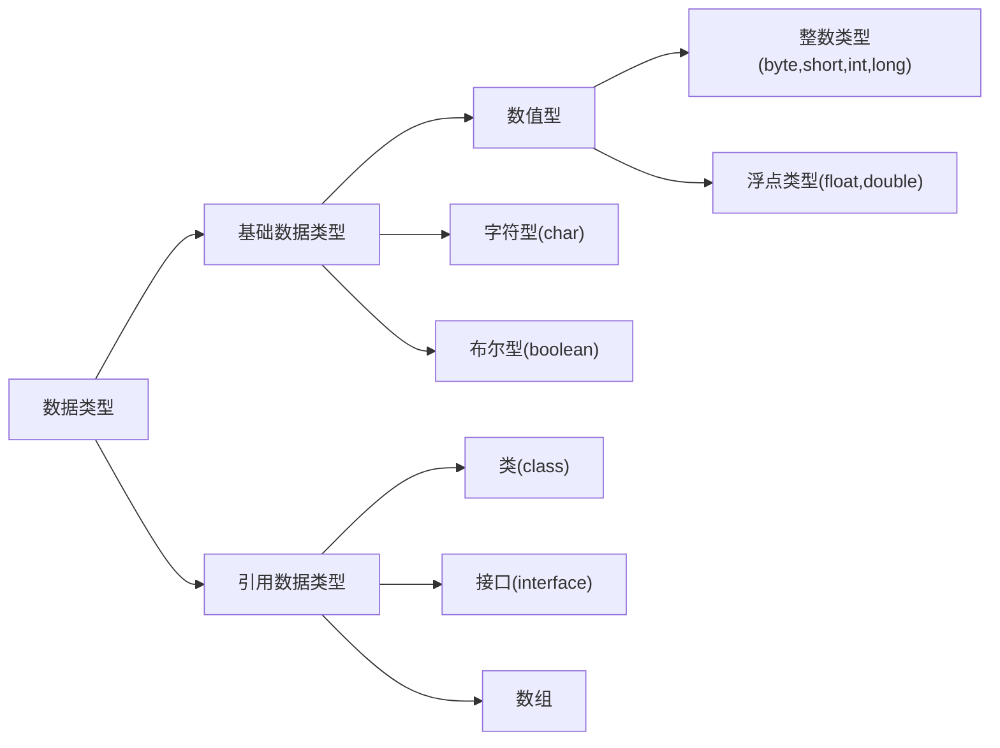
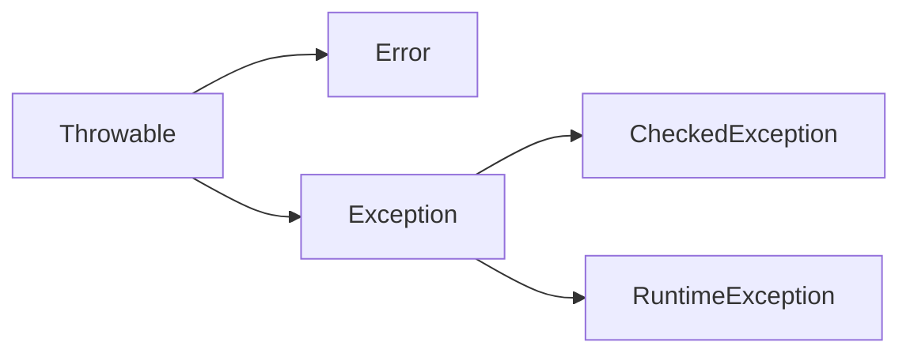

## Java基础

### 1.  单位换算

+ bit(位)：0,1
+ byte(字节)：1byte = 8bit
+ word(字)：1word = 2byte
+ 1KB = 1024bytes

### 2. Java中有几种基础类型，各占用多少字节



| 基础类型 |         大小          |                           取值范围                           |
| :------: | :-------------------: | :----------------------------------------------------------: |
| boolean  |       1字节/8位       |                         true, false                          |
|   byte   |  1字节/8位有符号整数  |                         -128 ~ +127                          |
|  short   | 2字节/16位有符号整数  |    -32768（-2<sup>15</sup>） ~ +32767(+2<sup>15</sup>-1)     |
|   int    | 4字节/32位有符号整数  | -2147483648（-2<sup>31</sup>） ~ +2147483647(2<sup>31</sup>-1) |
|   long   | 8字节/64位有符号整数  |              -2<sup>63</sup> ~ +2<sup>63</sup>               |
|   char   | 2字节/16位Unicode字符 |                0 ~ 65535（2<sup>16</sup>-1 ）                |
|  float   |   4字节/32位浮点数    |                     ±1.4E-45 ~ ±3.4E+38                      |
|  double  |   8字节/64位浮点数    |                    ±4.9E-324 ~ ±1.7E+308                     |

### 3. JDK 和 JRE 有什么区别

+ JDK：Java Development Kit 的简称，java 开发工具包，提供了 java 的开发环境和运行环境。
+ JRE：Java Runtime Environment 的简称，java 运行环境，为 java 的运行提供了所需环境。

> 具体来说 JDK 其实包含了 JRE，同时还包含了编译 java 源码的编译器 javac，还包含了很多 java 程序调试和分析的工具。简单来说：如果你需要运行 java 程序，只需安装 JRE 就可以了，如果你需要编写 java 程序，需要安装 JDK。

### 4. String 能被继承吗？为什么

> 不可以，因为 String 类有 final 修饰符，而 final 修饰的类是不能被继承的，实现细节不允许改变。平常我们定义的 `String str = ”a”` 其实和 `String str = new String(“a”)` 还是有差异的。
>
> * 前者默认调用的是String.valueOf来返回String实例对象，至于调用哪个则取决于你的赋值，比如 String num = 1,调用的是
>
> ```java
> public static String valueOf(int i) {
> 	return Integer.toString(i);
> }
> ```
>
> * 后者则是调用如下部分：
>
> ```java
> public String(String original) {
> 	this.value = original.value;
> 	this.hash = original.hash;
> }
> ```
>
> * 最后我们的变量都存储在一个char数组中
>
> ```java
> private final char value[];
> ```

### 4. String， Stringbuffer， StringBuilder 的区别。

> * String 字符串常量（final修饰，不可被继承），String是常量，当创建之后即不能更改。(可以通过StringBuffer和StringBuilder创建String对象（常用的两个字符串操作类）。)
>
> * StringBuffer 字符串变量（线程安全），其也是final类别的，不允许被继承，其中的绝大多数方法都进行了同步处理，包括常用的Append方法也做了同步处理（synchronized修饰）。其自 jdk1.0 起就已经出现。其toString方法会进行对象缓存，以减少元素复制开销。
>
> ```java
> public synchronized String toString() {
> 	if (toStringCache == null) {
> 		toStringCache = Arrays.copyOfRange(value, 0, count);
> 	}
> 	return new String(toStringCache, true);
> }
> ```
>
> * StringBuilder 字符串变量（非线程安全）==其自jdk1.5起开始出现。与StringBuffer一样都继承和实现了同样的接口和类，方法除了没使用synch修饰以外基本一致，不同之处在于最后toString的时候，会直接返回一个新对象。
>
> ```java
> public String toString() {
> 	// Create a copy, don’t share the array
> 	return new String(value, 0, count);
> }
> ```
>
> ---
>
> 1. 可变与不可变
>
>    * String 类中使用字符数组保存字符串，如下就是，因为有“final”修饰符，所以可以知道 string 对象是不可变的。`private final char value[];`
>
>    * StringBuilder 与 StringBuffer 都继承自AbstractStringBuilder类，在 AbstractStringBuilder 中也是使用字符数组保存字符串，如下就是，可知这两种对象都是可变的。`char[] value;`
>
> 2. 是否多线程安全
>
>    * String中的对象是不可变的，也就可以理解为常量，显然线程安全。
>
>    * AbstractStringBuilder 是 StringBuilder 与 StringBuffer 的公共父类，定义了一些字符串的基本操作，如 expandCapacity、append、insert、indexOf 等公共方法。
>
>    * StringBuffer对方法加了同步锁或者对调用的方法加了同步锁，所以是线程安全的。看如下源码：
>
>    ```java
>    public synchronized StringBuffer reverse() {
>        super.reverse();
>        return this;
>    }
>    
>    public int indexOf(String str) {
>    	//存在 public synchronized int indexOf(String str, int fromIndex) 方法
>        return indexOf(str, 0);
>    }
>    ```
>
>    * StringBuilder 并没有对方法进行加同步锁，所以是非线程安全的。
>
> 3. StringBuilder 与 StringBuffer 共同点
>
>    * StringBuilder 与StringBuffer 有公共父类 AbstractStringBuilder（抽象类）。
>    * 抽象类与接口的其中一个区别是：抽象类中可以定义一些子类的公共方法，子类只需要增加新的功能，不需要重复写已经存在的方法；而接口中只是对方法的申明和常量的定义。
>    * StringBuilder、StringBuffer 的方法都会调用 AbstractStringBuilder 中的公共方法，如super.append(...)。只是 StringBuffer 会在方法上加 synchronized 关键字，进行同步。
>
> 4. 最后，如果程序不是多线程的，那么使用 StringBuilder 效率高于 StringBuffer。

### 5. ArrayList 和 LinkedList 有什么区别。

​	ArrayList和LinkedList都实现了List接口，有以下的不同点：

> 1.  ArrayList是基于索引的数据接口，它的底层是数组。它可以以O(1)时间复杂度对元素进行随机访问。与此对应，LinkedList是以元素列表的形式存储它的数据，每一个元素都和它的前一个和后一个元素链接在一起，在这种情况下，查找某个元素的时间复杂度是O(n)。
> 2.  相对于ArrayList，LinkedList的插入，添加，删除操作速度更快，因为当元素被添加到集合任意位置的时候，不需要像数组那样重新计算大小或者是更新索引。
> 3.  LinkedList比ArrayList更占内存，因为LinkedList为每一个节点存储了两个引用，一个指向前一个元素，一个指向下一个元素。

### 6. 讲讲类的实例化顺序，比如父类静态数据，构造函数，字段，子类静态数据，构造函数，字段，当 new 的时候， 他们的执行顺序。

**此题考察的是类加载器实例化时进行的操作步骤（加载–>连接->初始化）。**

> 父类静态变量、
> 父类静态代码块、
> 子类静态变量、
> 子类静态代码块、
> 父类非静态变量（父类实例成员变量）、
> 父类构造函数、
> 子类非静态变量（子类实例成员变量）、
> 子类构造函数。
>
> [参阅博客《深入理解类加载》](http://blog.csdn.net/u014042066/article/details/77394480)

### 7. 用过哪些 Map 类，都有什么区别？

> 1. HashMap：
>
>    最常用的Map，根据键的hashcode值来存储数据，根据键可以直接获得他的值（因为相同的键hashcode值相同，在地址为hashcode值的地方存储的就是值，所以根据键可以直接获得值），具有很快的访问速度，遍历时，取得数据的顺序完全是随机的，HashMap最多只允许一条记录的键为null，允许多条记录的值为null，HashMap不支持线程同步，即任意时刻可以有多个线程同时写HashMap，这样对导致数据不一致，如果需要同步，可以使用synchronziedMap的方法使得HashMap具有同步的能力或者使用concurrentHashMap。
>
> 2. HashTable：
>
>    与HashMap类似，不同的是，它不允许记录的键或值为空，支持线程同步，即任意时刻只能有一个线程写HashTable，因此也导致HashTable在写入时比较慢!
>
> 3. LinkedHashMap：
>
>    是HahsMap的一个子类，但它保持了记录的插入顺序，遍历时先得到的肯定是先插入的，也可以在构造时带参数，按照应用次数排序，在遍历时会比HahsMap慢，不过有个例外，当HashMap的容量很大，实际数据少时，遍历起来会比LinkedHashMap慢（因为它是链啊），因为HashMap的遍历速度和它容量有关，LinkedHashMap遍历速度只与数据多少有关。
>
> 4. TreeMap：
>
>    实现了sortMap接口，能够把保存的记录按照键排序（默认升序），也可以指定排序比较器，遍历时得到的数据是排过序的。

### 8. 什么情况用什么类型的Map：

> * 在Map中插入，删除，定位元素：HashMap
> * 要按照自定义顺序或自然顺序遍历：TreeMap
> * 要求输入顺序和输出顺序相同：LinkedHashMap

### 9. HashMap 是线程安全的吗，并发下使用的 Map 是什么，他们内部原理分别是什么，比如存储方式， hashcode，扩容， 默认容量等。

> * hashMap是线程不安全的，HashMap是数组 + 链表 + 红黑树（JDK1.8增加了红黑树部分）实现的，采用哈希表来存储的。
> * HashTable、ConcurrentHashMap 
>
> 

### 10. 有没有有顺序的 Map 实现类， 如果有， 他们是怎么保证有序的。

> TreeMap 和 LinkedHashMap 是有序的（TreeMap 默认是key升序，LinkedHashMap 默认是数据插入顺序）。
>
> * TreeMap 是基于比较器Comparator来实现有序的。
> * LinkedHashmap 是基于链表来实现数据插入有序的。

### 11. 抽象类和接口的区别，类可以继承多个类么，接口可以继承多个接口么,类可以实现多个接口么。

> 1. 抽象类和接口都不能直接实例化，如果要实例化，抽象类变量必须指向实现所有抽象方法的子类对象，接口变量必须指向实现所有接口方法的类对象。
> 2. 抽象类要被子类继承，接口要被类实现。
> 3. 接口只能做方法申明，抽象类中可以做方法申明，也可以做方法实现。
> 4. 接口里定义的变量只能是公共的静态的常量，抽象类中的变量是普通变量。
> 5. 抽象类里的抽象方法必须全部被子类所实现，如果子类不能全部实现父类抽象方法，那么该子类只能是抽象类。同样，一个实现接口的时候，如不能全部实现接口方法，那么该类也只能为抽象类。
> 6. 抽象方法只能申明，不能实现。abstract void abc(); 不能写成 abstract void abc() {}。
> 7. 抽象类里可以没有抽象方法。
> 8. 如果一个类里有抽象方法，那么这个类只能是抽象类。
> 9. 抽象方法要被实现，所以不能是静态的，也不能是私有的。
> 10. 接口可继承接口，并可多继承接口，但类只能单根继承。

### 12. 继承、实现、依赖、关联、聚合、组合的联系与区别

> 1. **继承**：指的是一个类（称为子类、子接口）继承另外的一个类（称为父类、父接口）的功能，并可以增加它自己的新功能的能力，继承是类与类或者接口与接口之间最常见的关系；在 Java 中此类关系通过关键字extends明确标识，在设计时一般没有争议性。
> 2. **实现**：指的是一个 class 类实现 interface 接口（可以是多个）的功能；实现是类与接口之间最常见的关系；在 Java 中此类关系通过关键字 implements 明确标识，在设计时一般没有争议性；
> 3. **依赖**：可以简单的理解，就是一个类A使用到了另一个类B，而这种使用关系是具有偶然性的、临时性的、非常弱的，但是B类的变化会影响到A；比如某人要过河，需要借用一条船，此时人与船之间的关系就是依赖；表现在代码层面，为类B作为参数被类A在某个 method 方法中使用。
> 4. **关联**：他体现的是两个类、或者类与接口之间语义级别的一种强依赖关系，比如我和我的朋友；这种关系比依赖更强、不存在依赖关系的偶然性、关系也不是临时性的，一般是长期性的，而且双方的关系一般是平等的、关联可以是单向、双向的；表现在代码层面，为被关联类B以类属性的形式出现在关联类A中，也可能是关联类A引用了一个类型为被关联类B的全局变量。
> 5. **聚合**：是关联关系的一种特例，他体现的是整体与部分、拥有的关系，即has-a的关系，此时整体与部分之间是可分离的，他们可以具有各自的生命周期，部分可以属于多个整体对象，也可以为多个整体对象共享；比如计算机与CPU、公司与员工的关系等；表现在代码层面，和关联关系是一致的，只能从语义级别来区分。
> 6. **组合 (a拥有b，a没了b也就没了，实心)**：组合也是关联关系的一种特例，他体现的是一种contains-a的关系，这种关系比聚合更强，也称为强聚合；他同样体现整体与部分间的关系，但此时整体与部分是不可分的，整体的生命周期结束也就意味着部分的生命周期结束；比如你和你的大脑；表现在代码层面，和关联关系是一致的，只能从语义级别来区分。

### 13. 讲讲你理解的 NIO 和 NIO 的区别是啥，谈谈 reactor 模型。

> IO(BIO)是面向流的，NIO是面向缓冲区的
>
> * BIO：Block IO 同步阻塞式 IO，就是我们平常使用的传统 IO，它的特点是模式简单使用方便，并发处理能力低。
> * NIO：New IO 同步非阻塞 IO，是传统 IO 的升级，客户端和服务器端通过 Channel（通道）通讯，实现了多路复用。
> * AIO：Asynchronous IO 是 NIO 的升级，也叫 NIO2，实现了异步非堵塞 IO ，异步 IO 的操作基于事件和回调机制。
>
> ---
>
> |   IO   |   NIO    |
> | :----: | :------: |
> | 面向流 | 面向缓冲 |
> | 阻塞IO | 非阻塞IO |
> |   无   |  选择器  |
>
> [Java NIO与BIO](https://www.jianshu.com/p/3f703d3d804c)

### 14. 反射的原理，反射创建类实例的三种方式是什么？

> 1. **什么是JAVA的反射机制？**
>
>    * Java反射是Java被视为动态（或准动态）语言的一个关键性质。这个机制允许程序在运行时透过Reflection APIs取得任何一个已知名称的class的内部信息，包括其modifiers（诸如public, static 等）、superclass（例如Object）、实现之interfaces（例如Cloneable），也包括fields和methods的所有信息，并可于运行时改变fields内容或唤起methods。
>
>      Java反射机制容许程序在运行时加载、探知、使用编译期间完全未知的classes。
>
>      换言之，Java可以加载一个运行时才得知名称的class，获得其完整结构。
>
>    * 反射机制能够实现**在运行时对类进行装载**，因此能增加程序的灵活性，但是不恰当地使用反射机制，也会严重影响系统的性能。具体而言，反射机制提供的功能主要有：得到一个对象所属的类；获取一个类的所有成员变量和方法；在运行时创建对象；在运行时调用对象的方法。
>      可以配合[JVM加载class文件的原理机制](https://www.jianshu.com/p/cdfdeffc8d34)来理解
>
> 2. **JDK中提供的Reflection API**
>
>    | Member接口         | 该接口可以获取有关类成员（域或者方法）后者构造函数的信息。   |
>    | ------------------ | ------------------------------------------------------------ |
>    | AccessibleObject类 | 该类是域(field)对象、方法(method)对象、构造函数(constructor)对象的基础类。它提供了将反射的对象标记为在使用时取消默认 Java 语言访问控制检查的能力。 |
>    | Array类            | 该类提供动态地生成和访问JAVA数组的方法。                     |
>    | Constructor类      | 提供一个类的构造函数的信息以及访问类的构造函数的接口。       |
>    | Field类            | 提供一个类的域的信息以及访问类的域的接口。                   |
>    | Method类           | 提供一个类的方法的信息以及访问类的方法的接口。               |
>    | Modifier类         | 提供了 static 方法和常量，对类和成员访问修饰符进行解码。     |
>    | Proxy类            | 提供动态地生成代理类和类实例的静态方法。                     |
>
> 3. **JAVA反射机制提供了什么功能**
>
>    * 在运行时判断任意一个对象所属的类（获取类的Class对象）
>    * 在运行时构造任意一个类的对象（获取类的Fields）
>    * 在运行时判段任意一个类所具有的成员变量和方法（获取类的Method）
>    * 在运行时调用任一个对象的方法（获取类的Constructor）
>    * 在运行时创建新类对象（新建类的实例）
>
> 4. **反射创建类实例的三种方式**
>
>    1. 使用 Class.forName 静态方法。
>
>       前提：已明确类的全路径名。
>
>    2. 使用 .class 方法。
>
>       说明：仅适合在编译前就已经明确要操作的 Class
>
>    3. 使用类对象的 getClass() 方法。

### 15. 反射中，Class.forName 和 ClassLoader 区别。

>  在Java中，类装载器把一个类装入Java虚拟机中，要经过三个步骤来完成：装载、链接和初始化，其中链接又可以分成校验、准备和解析三步，除了解析外，其它步骤是严格按照顺序完成的，各个步骤的主要工作如下：
>
> 	1. 装载：查找和导入类或接口的二进制数据； 
>  	2. 链接：执行下面的校验、准备和解析步骤，其中解析步骤是可以选择的； 
>  	3. 校验：检查导入类或接口的二进制数据的正确性； 
>  	4. 准备：给类的静态变量分配并初始化存储空间； 
>  	5. 解析：将符号引用转成直接引用； 
>  	6. 初始化：激活类的静态变量的初始化Java代码和静态Java代码块。
>
> *  Class.forName(className)方法，其实调用的方法是Class.forName(className,true,classloader);注意看第2个boolean参数，它表示的意思，在loadClass后必须初始化。比较下我们前面准备jvm加载类的知识，我们可以清晰的看到在执行过此方法后，目标对象的 static块代码已经被执行，static参数也已经被初始化。
> * 再看ClassLoader.loadClass(className)方法，其实他调用的方法是ClassLoader.loadClass(className,false);还是注意看第2个 boolean参数，该参数表示目标对象被装载后不进行链接，这就意味这不会去执行该类静态块中间的内容。因此2者的区别就显而易见了。
>
>  最后还有必要在此提一下new方法和newInstance方法的区别：
>
> 	* newInstance：弱类型。低效率。只能调用无参构造。
> 	* new：强类型。相对高效。能调用任何public构造。

### 16. 描述动态代理的几种实现方式，分别说出相应的优缺点。

> 两种方式，分别是：JDK动态代理、cglib动态代理
>
> * JDK动态代理
>
>   - 利用反射机制生成一个实现代理接口的匿名类，在调用具体方法前调用InvokeHandler来处理。
>
>   - JDK动态代理，底层是利用反射机制，需要基于接口方式，这是由于：
>
>   ```java
>   Proxy.newProxyInstance(target.getClass().getClassLoader(),
>   target.getClass().getInterfaces(), this);
>   ```
>
> * cglib动态代理
>
>   - cglib动态代理，则是基于asm框架，实现了无反射机制进行代理，利用空间来换取了时间，代理效率高于jdk
>   - 利用asm开源包，对代理对象类的class文件加载进来，通过修改其字节码生成子类来处理。
>
> **区别**
>
> 	* JDK动态代理只能对实现了接口的类生成代理，而不能针对类
> 	* CGLIB是针对类实现代理，主要是对指定的类生成一个子类，覆盖其中的方法 因为是继承，所以该类或方法不要声明成final
>
> **问题：为什么 CGlib 方式可以对接口实现代理。**
>
> ​	（可以直接回答上述区别中CGLIB的特点）

### 17. final 的用途

> **针对三方面类、变量、方法**
>
> * final 修饰的类叫最终类，该类不能被继承。
> * final 修饰的变量叫常量，常量必须初始化，初始化之后值就不能被修改。
> * final 修饰的方法不能被重写。

### 18. 写出三种单例模式实现

> **什么是单例模式**
>
> ​		单例模式（Singleton Pattern）是 Java 中最简单的设计模式之一。这种类型的设计模式属于创建型模式，它提供了一种创建对象的最佳方式。
>
> ​		这种模式涉及到一个单一的类，该类负责创建自己的对象，同时确保只有单个对象被创建。这个类提供了一种访问其唯一的对象的方式，可以直接访问，不需要实例化该类的对象。
>
> 注意：
>
> 				1. 单例类只能有一个实例。
>    				2. 单例类必须自己创建自己的唯一实例。
>       				3. 单例类必须给所有其他对象提供这一实例。
>
> 
>
> 懒汉式、饿汉式、双检锁、静态内部类、枚举等
>
> 1. **懒汉式**
>
>    线程不安全，延迟初始化，严格意义上不是不是单例模式
>
>    ```java
>    public class Singleton {
>        
>        private static Singleton instance;
>        
>        private Singleton () {}
>    
>        public static synchronized Singleton getInstance() {
>            if (instance == null) {
>                instance = new Singleton();
>            }
>            return instance;
>        }
>        
>    }
>    ```
>
> 2. **饿汉式**
>
>    线程安全，比较常用，但容易产生垃圾，因为一开始就初始化
>
>    ```java
>    public class Singleton {
>        
>        private static Singleton instance = new Singleton();
>        
>        private Singleton () {}
>        
>        public static Singleton getInstance() {
>        	return instance;
>        }
>        
>    }
>    ```
>
> 3. **双检锁**
>
>    线程安全，延迟初始化。这种方式采用双锁机制，安全且在多线程情况下能保持高性能。
>
>    ```java
>    public class Singleton {
>        
>        private volatile static Singleton singleton;
>        
>        private Singleton (){}
>        
>        public static Singleton getSingleton() {
>            if (singleton == null) {
>                synchronized (Singleton.class) {
>                    if (singleton == null) {
>                        singleton = new Singleton();
>                    }
>                }
>            }
>            return singleton;
>        }
>        
>    }
>    ```
>
> 4. 静态内部类
>
>    只有第一次调用getInstance方法时，虚拟机才加载 Inner 并初始化instance ，只有一个线程可以获得对象的初始化锁，其他线程无法进行初始化，保证对象的唯一性。目前此方式是所有单例模式中最推荐的模式，但具体还是根据项目选择。
>
>    ```java
>    public class Singleton {
>        
>        private static class SingletonHolder {
>        	private static final Singleton INSTANCE = new Singleton();
>        }
>        
>        private Singleton () {}
>        
>        public static final Singleton getInstance() {
>            return SingletonHolder.INSTANCE;
>        }
>        
>    } 
>    ```
>
> 5. 枚举
>
>    这种方式是Effective Java作者Josh Bloch 提倡的方式，它不仅能避免多线程同步问题，而且还能防止反序列化重新创建新的对象，可谓是很坚强的壁垒啊，不过，个人认为由于1.5中才加入enum特性，用这种方式写不免让人感觉生疏，在实际工作中，我也很少看见有人这么写过。
>
>    ```java
>    public enum Singleton {
>        
>        INSTANCE;
>        
>        public void whateverMethod() {
>        }
>        
>    }
>    ```

### 19. 如何在父类中为子类自动完成所有的 hashcode 和 equals 实现？这么做有何优劣？

> 同时复写hashcode和equals方法，优势可以添加自定义逻辑，且不必调用超类的实现。
>
> [equals和hashCode解析](https://www.iteye.com/blog/java-min-1416727)

### 20. 请结合 OO 设计理念，谈谈访问修饰符 public、private、protected、default 在应用设计中的作用。

> 访问修饰符，主要标示修饰块的作用域，方便隔离防护
>
> 类中的数据成员和成员函数据具有的访问权限包括：public、private、protect、default（包访问权限）
>
> |  作用于   | 当前类 | 同一package | 子孙类 | 其他package |
> | :-------: | :----: | :---------: | :----: | :---------: |
> |  public   |   √    |      √      |   √    |      √      |
> | protected |   √    |      √      |   √    |      ×      |
> |  default  |   √    |      √      |   ×    |      ×      |
> |  private  |   √    |      ×      |   ×    |      ×      |

### 21. 深拷贝和浅拷贝区别。

> **什么是拷贝?**
>
> 	* **引用拷贝**，正如它的名称所表述的意思, 就是创建一个指向对象的引用变量的拷贝。如果我们有一个 Car 对象，而且让 myCar 变量指向这个变量，这时候当我们做引用拷贝，那么现在就会有两个 myCar 变量，但是对象仍然只存在一个。
> 	* **对象拷贝**，会创建对象本身的一个副本。因此如果我们再一次服务我们 car 对象，就会创建这个对象本身的一个副本, 同时还会有第二个引用变量指向这个被复制出来的对象。
>
> * **浅拷贝**，对象的浅拷贝会对“主”对象进行拷贝，但不会复制主对象里面的对象。"里面的对象“会在原来的对象和它的副本之间共享。例如，我们会为一个 Person对象创建第二个 Person 对象, 而两个 Person 会共享相同的 Name 和 Address 对象。
> * **深拷贝**，不同于浅拷贝，深拷贝是一个整个独立的对象拷贝。如果我们对整个 Person对象进行深拷贝，我们会对整个对象的结构都进行拷贝。
>
> 简单来说浅拷贝跟深拷贝的区别就是复制引用和复制值

### 22. 数组和链表数据结构描述，各自的时间复杂度。

> * **数组**：是将元素在内存中连续存放，由于每个元素占用内存相同，可以通过下标迅速访问数组中任何元素。但是如果要在数组中增加一个元素，需要移动大量元素，在内存中空出一个元素的空间，然后将要增加的元素放在其中。同样的道理，如果想删除一个元素，同样需要移动大量元素去填掉被移动的元素。如果应用需要快速访问数据，很少插入和删除元素，就应该用数组。
> * **链表**：中的元素在内存中不是顺序存储的，而是通过存在元素中的指针联系到一起，每个结点包括两个部分：一个是存储 数据元素 的　数据域，另一个是存储下一个结点地址的 指针。如果要访问链表中一个元素，需要从第一个元素开始，一直找到需要的元素位置。但是增加和删除一个元素对于链表数据结构就非常简单了，只要修改元素中的指针就可以了。如果应用需要经常插入和删除元素你就需要用链表。
>
> **内存存储区别**
>
> 	* 数组从栈中分配空间，对于程序员方便快速，但自由度小。
> 	* 链表从堆中分配空间，自由度大但申请管理比较麻烦。
>
> **逻辑结构区别**
>
> * **数组**必须事先定义固定的长度（元素个数），不能适应数据动态地增减的情况。当数据增加时，可能超出原先定义的元素个数；当数据减少时，造成内存浪费。　
> * **链表**动态地进行存储分配，可以适应数据动态地增减的情况，且可以方便地插入、删除数据项。（数组中插入、删除数据项时，需要移动其它数据项）
>
> **总结**
>
> 1. 存取方式上，数组可以顺序存取或者随机存取，而链表只能顺序存取；
>
> 2. 存储位置上，数组逻辑上相邻的元素在物理存储位置上也相邻，而链表不一定；
>
> 3. 存储空间上，链表由于带有指针域，存储密度不如数组大；
>
> 4. 按序号查找时，数组可以随机访问，时间复杂度为O(1)，而链表不支持随机访问，平均需要O(n)；
>
> 5. 按值查找时，若数组无序，数组和链表时间复杂度均为O(1)，但是当数组有序时，可以采用折半查找将时间复杂度降为O(logn)；
>
> 6. 插入和删除时，数组平均需要移动n/2个元素，而链表只需修改指针即可；
>
> 7. 空间分配方面： 
>
>    * 数组在静态存储分配情形下，存储元素数量受限制，动态存储分配情形下，虽然存储空间可以扩充，但需要移动大量元素，导致操作效率降低，而且如果内存中没有更大块连续存储空间将导致分配失败； 
>
>    * 链表存储的节点空间只在需要的时候申请分配，只要内存中有空间就可以分配，操作比较灵活高效；

### 23. error 和 exception 的区别，CheckedException，RuntimeException 的区别



>* java.lang.Throwable是所有异常的根
>* java.lang.Error是错误信息
>* java.lang.Exception是异常信息


### 7. List、Set、Map 之间的区别是什么？

### 

------------------------------------------------


### 4. == 和 equals 的区别是什么？

+ == 解读

  对于基本类型和引用类型 == 的作用效果是不同的，如下所示：

  + 基本类型：比较的是值是否相同；
  + 引用类型：比较的是引用是否相同；

代码示例：

```java
String x = "string";
String y = "string";
String z = new String("string");
System.out.println(x == y); // true
System.out.println(x == z); // false
System.out.println(x.equals(y)); // true
System.out.println(x.equals(z)); // true
```

代码解读：因为 x 和 y 指向的是同一个引用，所以 == 也是 true，而 new String()方法则重写开辟了内存空间，所以 == 结果为 false，而 equals 比较的一直是值，所以结果都为 true。

