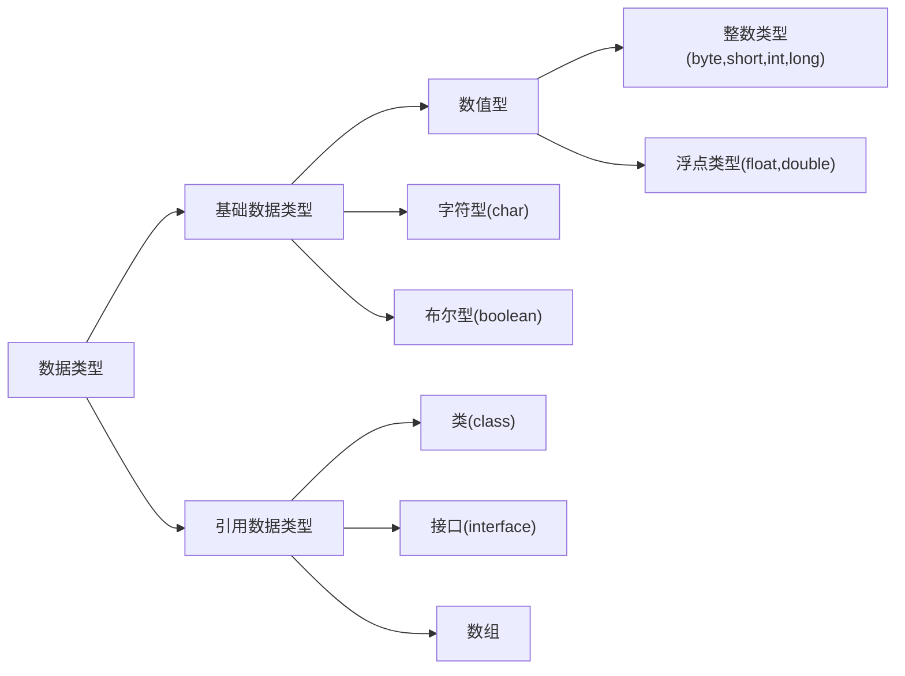

## Java基础

### 1.  单位换算

+ bit(位)：0,1
+ byte(字节)：1byte = 8bit
+ word(字)：1word = 2byte
+ 1KB = 1024bytes

### 2. Java中有几种基础类型，各占用多少字节



| 基础类型 |         大小          |                           取值范围                           |
| :------: | :-------------------: | :----------------------------------------------------------: |
| boolean  |       1字节/8位       |                         true, false                          |
|   byte   |  1字节/8位有符号整数  |                         -128 ~ +127                          |
|  short   | 2字节/16位有符号整数  |    -32768（-2<sup>15</sup>） ~ +32767(+2<sup>15</sup>-1)     |
|   int    | 4字节/32位有符号整数  | -2147483648（-2<sup>31</sup>） ~ +2147483647(2<sup>31</sup>-1) |
|   long   | 8字节/64位有符号整数  |              -2<sup>63</sup> ~ +2<sup>63</sup>               |
|   char   | 2字节/16位Unicode字符 |                0 ~ 65535（2<sup>16</sup>-1 ）                |
|  float   |   4字节/32位浮点数    |                     ±1.4E-45 ~ ±3.4E+38                      |
|  double  |   8字节/64位浮点数    |                    ±4.9E-324 ~ ±1.7E+308                     |

### 3. JDK 和 JRE 有什么区别

+ JDK：Java Development Kit 的简称，java 开发工具包，提供了 java 的开发环境和运行环境。
+ JRE：Java Runtime Environment 的简称，java 运行环境，为 java 的运行提供了所需环境。

> 具体来说 JDK 其实包含了 JRE，同时还包含了编译 java 源码的编译器 javac，还包含了很多 java 程序调试和分析的工具。简单来说：如果你需要运行 java 程序，只需安装 JRE 就可以了，如果你需要编写 java 程序，需要安装 JDK。

### 4. String 能被继承吗？为什么

> 不可以，因为 String 类有 final 修饰符，而 final 修饰的类是不能被继承的，实现细节不允许改变。平常我们定义的 `String str = ”a”` 其实和 `String str = new String(“a”)` 还是有差异的。
>
> * 前者默认调用的是String.valueOf来返回String实例对象，至于调用哪个则取决于你的赋值，比如 String num = 1,调用的是
>
> ```java
> public static String valueOf(int i) {
> 	return Integer.toString(i);
> }
> ```
> * 后者则是调用如下部分：
>
> ```java
> public String(String original) {
> 	this.value = original.value;
> 	this.hash = original.hash;
> }
> ```
>
> * 最后我们的变量都存储在一个char数组中
>
> ```java
> private final char value[];
> ```

### 4. String， Stringbuffer， StringBuilder 的区别。

> * String 字符串常量（final修饰，不可被继承），String是常量，当创建之后即不能更改。(可以通过StringBuffer和StringBuilder创建String对象（常用的两个字符串操作类）。)
>
> * StringBuffer 字符串变量（线程安全），其也是final类别的，不允许被继承，其中的绝大多数方法都进行了同步处理，包括常用的Append方法也做了同步处理（synchronized修饰）。其自 jdk1.0 起就已经出现。其toString方法会进行对象缓存，以减少元素复制开销。
>
> ```java
> public synchronized String toString() {
> 	if (toStringCache == null) {
> 		toStringCache = Arrays.copyOfRange(value, 0, count);
> 	}
> 	return new String(toStringCache, true);
> }
> ```
>
> * StringBuilder 字符串变量（非线程安全）==其自jdk1.5起开始出现。与StringBuffer一样都继承和实现了同样的接口和类，方法除了没使用synch修饰以外基本一致，不同之处在于最后toString的时候，会直接返回一个新对象。
>
> ```java
> public String toString() {
> 	// Create a copy, don’t share the array
> 	return new String(value, 0, count);
> }
> ```
>
> ---
>
> 1. 可变与不可变
>
>    * String 类中使用字符数组保存字符串，如下就是，因为有“final”修饰符，所以可以知道 string 对象是不可变的。`private final char value[];`
>
>    * StringBuilder 与 StringBuffer 都继承自AbstractStringBuilder类，在 AbstractStringBuilder 中也是使用字符数组保存字符串，如下就是，可知这两种对象都是可变的。`char[] value;`
>
> 2. 是否多线程安全
>
>    * String中的对象是不可变的，也就可以理解为常量，显然线程安全。
>
>    * AbstractStringBuilder 是 StringBuilder 与 StringBuffer 的公共父类，定义了一些字符串的基本操作，如 expandCapacity、append、insert、indexOf 等公共方法。
>
>    * StringBuffer对方法加了同步锁或者对调用的方法加了同步锁，所以是线程安全的。看如下源码：
>
>    ```java
>    public synchronized StringBuffer reverse() {
>        super.reverse();
>        return this;
>    }
>    
>    public int indexOf(String str) {
>    	//存在 public synchronized int indexOf(String str, int fromIndex) 方法
>        return indexOf(str, 0);
>    }
>    ```
>
>    * StringBuilder 并没有对方法进行加同步锁，所以是非线程安全的。
>
> 3. StringBuilder 与 StringBuffer 共同点
>
>    * StringBuilder 与StringBuffer 有公共父类 AbstractStringBuilder（抽象类）。
>    * 抽象类与接口的其中一个区别是：抽象类中可以定义一些子类的公共方法，子类只需要增加新的功能，不需要重复写已经存在的方法；而接口中只是对方法的申明和常量的定义。
>    * StringBuilder、StringBuffer 的方法都会调用 AbstractStringBuilder 中的公共方法，如super.append(...)。只是 StringBuffer 会在方法上加 synchronized 关键字，进行同步。
>
> 4. 最后，如果程序不是多线程的，那么使用 StringBuilder 效率高于 StringBuffer。

### 5. ArrayList 和 LinkedList 有什么区别。

​	ArrayList和LinkedList都实现了List接口，有以下的不同点：

> 1.  ArrayList是基于索引的数据接口，它的底层是数组。它可以以O(1)时间复杂度对元素进行随机访问。与此对应，LinkedList是以元素列表的形式存储它的数据，每一个元素都和它的前一个和后一个元素链接在一起，在这种情况下，查找某个元素的时间复杂度是O(n)。
> 2.  相对于ArrayList，LinkedList的插入，添加，删除操作速度更快，因为当元素被添加到集合任意位置的时候，不需要像数组那样重新计算大小或者是更新索引。
> 3.  LinkedList比ArrayList更占内存，因为LinkedList为每一个节点存储了两个引用，一个指向前一个元素，一个指向下一个元素。

### 6. 讲讲类的实例化顺序，比如父类静态数据，构造函数，字段，子类静态数据，构造函数，字段，当 new 的时候， 他们的执行顺序。

**此题考察的是类加载器实例化时进行的操作步骤（加载–>连接->初始化）。**

> 父类静态变量、
> 父类静态代码块、
> 子类静态变量、
> 子类静态代码块、
> 父类非静态变量（父类实例成员变量）、
> 父类构造函数、
> 子类非静态变量（子类实例成员变量）、
> 子类构造函数。
>
> [参阅博客《深入理解类加载》](http://blog.csdn.net/u014042066/article/details/77394480)

### 7. 用过哪些 Map 类，都有什么区别？

> 1. HashMap：
>
>    最常用的Map，根据键的hashcode值来存储数据，根据键可以直接获得他的值（因为相同的键hashcode值相同，在地址为hashcode值的地方存储的就是值，所以根据键可以直接获得值），具有很快的访问速度，遍历时，取得数据的顺序完全是随机的，HashMap最多只允许一条记录的键为null，允许多条记录的值为null，HashMap不支持线程同步，即任意时刻可以有多个线程同时写HashMap，这样对导致数据不一致，如果需要同步，可以使用synchronziedMap的方法使得HashMap具有同步的能力或者使用concurrentHashMap。
>
> 2. HashTable：
>
>    与HashMap类似，不同的是，它不允许记录的键或值为空，支持线程同步，即任意时刻只能有一个线程写HashTable，因此也导致HashTable在写入时比较慢!
>
> 3. LinkedHashMap：
>
>    是HahsMap的一个子类，但它保持了记录的插入顺序，遍历时先得到的肯定是先插入的，也可以在构造时带参数，按照应用次数排序，在遍历时会比HahsMap慢，不过有个例外，当HashMap的容量很大，实际数据少时，遍历起来会比LinkedHashMap慢（因为它是链啊），因为HashMap的遍历速度和它容量有关，LinkedHashMap遍历速度只与数据多少有关。
>
> 4. TreeMap：
>
>    实现了sortMap接口，能够把保存的记录按照键排序（默认升序），也可以指定排序比较器，遍历时得到的数据是排过序的。

### 9. 什么情况用什么类型的Map：

> * 在Map中插入，删除，定位元素：HashMap
> * 要按照自定义顺序或自然顺序遍历：TreeMap
> * 要求输入顺序和输出顺序相同：LinkedHashMap

### 8. HashMap 是线程安全的吗，并发下使用的 Map 是什么，他们内部原理分别是什么，比如存储方式， hashcode，扩容， 默认容量等。

> hashMap是线程不安全的，HashMap是数组 + 链表 + 红黑树（JDK1.8增加了红黑树部分）实现的，采用哈希表来存储的，

### 8. 有没有有顺序的 Map 实现类， 如果有， 他们是怎么保证有序的。

### 9. 抽象类和接口的区别，类可以继承多个类么，接口可以继承多个接口么,类可以实现多个接口么。

### 10. 继承和聚合的区别在哪。


### 7. List、Set、Map 之间的区别是什么？

### 

------------------------------------------------


### 4. == 和 equals 的区别是什么？

+ == 解读

  对于基本类型和引用类型 == 的作用效果是不同的，如下所示：

  + 基本类型：比较的是值是否相同；
  + 引用类型：比较的是引用是否相同；

代码示例：

```java
String x = "string";
String y = "string";
String z = new String("string");
System.out.println(x == y); // true
System.out.println(x == z); // false
System.out.println(x.equals(y)); // true
System.out.println(x.equals(z)); // true
```

代码解读：因为 x 和 y 指向的是同一个引用，所以 == 也是 true，而 new String()方法则重写开辟了内存空间，所以 == 结果为 false，而 equals 比较的一直是值，所以结果都为 true。

