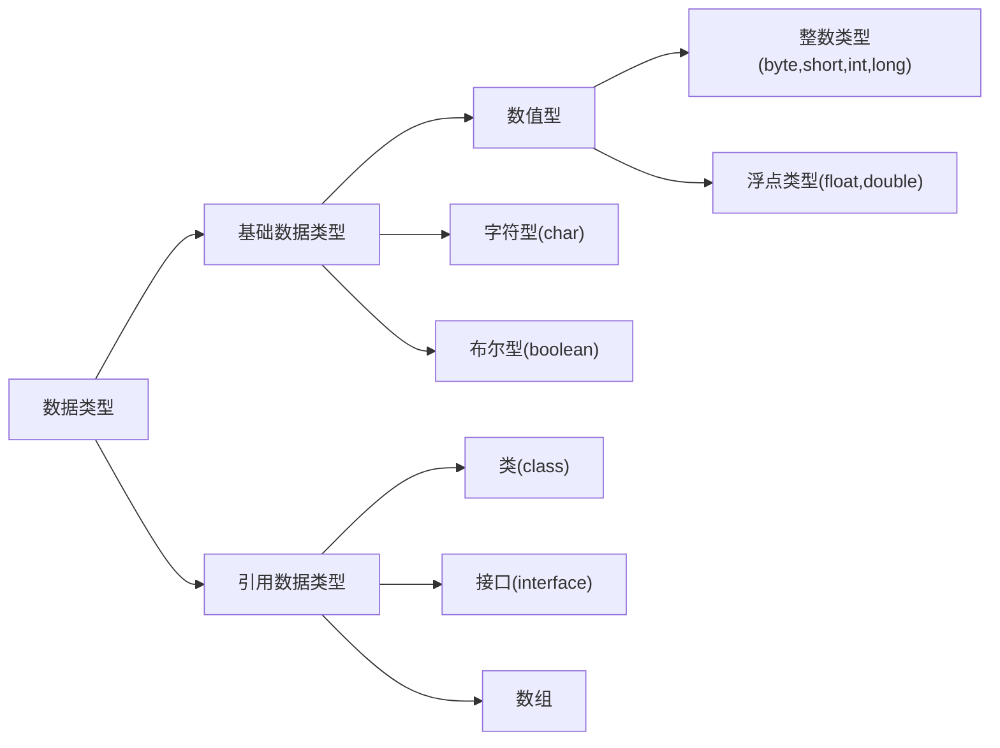

## Java基础

### 1.  单位换算

+ bit(位)：0,1
+ byte(字节)：1byte = 8bit
+ word(字)：1word = 2byte
+ 1KB = 1024bytes

### 2. Java中有几种基础类型，各占用多少字节



| 基础类型 |         大小          |                           取值范围                           |
| :------: | :-------------------: | :----------------------------------------------------------: |
| boolean  |       1字节/8位       |                         true, false                          |
|   byte   |  1字节/8位有符号整数  |                         -128 ~ +127                          |
|  short   | 2字节/16位有符号整数  |    -32768（-2<sup>15</sup>） ~ +32767(+2<sup>15</sup>-1)     |
|   int    | 4字节/32位有符号整数  | -2147483648（-2<sup>31</sup>） ~ +2147483647(2<sup>31</sup>-1) |
|   long   | 8字节/64位有符号整数  |              -2<sup>63</sup> ~ +2<sup>63</sup>               |
|   char   | 2字节/16位Unicode字符 |                0 ~ 65535（2<sup>16</sup>-1 ）                |
|  float   |   4字节/32位浮点数    |                     ±1.4E-45 ~ ±3.4E+38                      |
|  double  |   8字节/64位浮点数    |                    ±4.9E-324 ~ ±1.7E+308                     |

### 3. JDK 和 JRE 有什么区别

+ JDK：Java Development Kit 的简称，java 开发工具包，提供了 java 的开发环境和运行环境。
+ JRE：Java Runtime Environment 的简称，java 运行环境，为 java 的运行提供了所需环境。

> 具体来说 JDK 其实包含了 JRE，同时还包含了编译 java 源码的编译器 javac，还包含了很多 java 程序调试和分析的工具。简单来说：如果你需要运行 java 程序，只需安装 JRE 就可以了，如果你需要编写 java 程序，需要安装 JDK。

### 4. String 能被继承吗？为什么

> 不可以，因为 String 类有 final 修饰符，而 final 修饰的类是不能被继承的，实现细节不允许改变。平常我们定义的 String st r= ”a”; 其实和 String str=new String(“a”) 还是有差异的。
> 前者默认调用的是String.valueOf来返回String实例对象，至于调用哪个则取决于你的赋值，比如String num=1,调用的是
>
> ```java
> public static String valueOf(int i) {
> 	return Integer.toString(i);
> }
> ```
>后者则是调用如下部分：
> ```java
> public String(String original) {
> 	this.value = original.value;
> 	this.hash = original.hash;
> }
> ```
>
> 

### 4. == 和 equals 的区别是什么？

+ == 解读

  对于基本类型和引用类型 == 的作用效果是不同的，如下所示：

  + 基本类型：比较的是值是否相同；
  + 引用类型：比较的是引用是否相同；

代码示例：

```java
String x = "string";
String y = "string";
String z = new String("string");
System.out.println(x == y); // true
System.out.println(x == z); // false
System.out.println(x.equals(y)); // true
System.out.println(x.equals(z)); // true
```

代码解读：因为 x 和 y 指向的是同一个引用，所以 == 也是 true，而 new String()方法则重写开辟了内存空间，所以 == 结果为 false，而 equals 比较的一直是值，所以结果都为 true。

