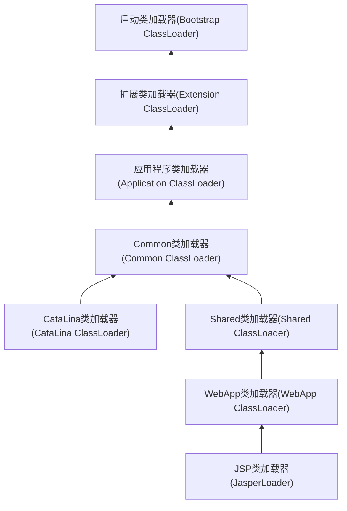

## 5. Tomcat

### 5.1 简单讲讲 tomcat 结构，以及其类加载器流程。

Server: 多个service
Container级别的：–> engine –> host –> context
Listenter
Connector
Logging、Naming、Session、JMX等等

通过WebappClassLoader 加载class

**特点**

1. 同一个服务器上的两个web应用程序，其类库相互隔离（同一个类库不同版本相互隔离）。
2. 同一个服务器上的两个web应用程序，所使用的java类库可以相互共享【避免方法区过度膨胀】（同一个类库相同版本可以共享）。
3. 服务器所使用的类库与应用程序类库相互独立。
4. 支持JSP应用的web服务器：都需要支持热替换（HoSwap）。weblogic不支持。

**Tomcat加载结构**

[Tomcat 系统架构与设计模式，第 1 部分](https://www.ibm.com/developerworks/cn/java/j-lo-tomcat1/)

[深入剖析Tomcat类加载机制](https://blog.csdn.net/dc_726/article/details/11873343)

[图解Tomcat类加载机制](https://www.cnblogs.com/xing901022/p/4574961.html)

[Tomcat体系结构及执行流程](https://www.jianshu.com/p/62ec977996df)

### 5.2 tomcat 如何调优，涉及哪些参数。

硬件上选择，操作系统选择，版本选择，jdk选择，配置jvm参数，配置connector的线程数量，开启gzip压缩，trimSpaces，集群等

* **内存优化**：主要是对Tomcat启动参数进行优化，我们可以在Tomcat启动脚本中修改它的最大内存数等等。
* **线程数优化**：Tomcat的并发连接参数，主要在Tomcat配置文件中server.xml中配置，比如修改最小空闲连接线程数，用于提高系统处理性能等等。
* **优化缓存**：打开压缩功能，修改参数，比如压缩的输出内容大小默认为2KB，可以适当的修改。